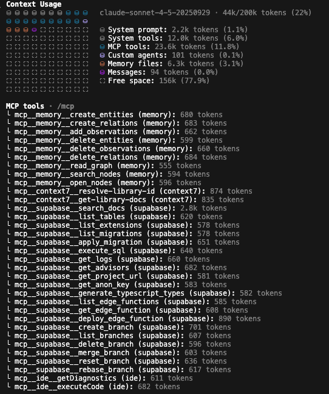

# Switchboard

[](https://www.npmjs.com/package/@george5562/switchboard)
[](./test/)
[](https://nodejs.org/)
[](./LICENSE)

MCP proxy that aggregates multiple child MCPs into suite tools with lazy subtool expansion. Presents one tool per MCP to the host, revealing subtools on demand. Typical token reduction: 85-90%. Memory MCP: 5,913 → 634 tokens (89%). Large MCPs like Supabase save 20,000+ tokens.

---

## Installation

```bash
npm install -g @george5562/switchboard
```

Or use directly without installation:

```bash
npx @george5562/switchboard init
```

Requirements: Node.js v18+

---

## Quick Start

**1. Install:**

```bash
npm install -g @george5562/switchboard
```

**2. Initialize:**

```bash
cd your-project
switchboard init
```

Migrates existing `.mcp.json` and creates `.switchboard/mcps/[name]/.mcp.json` for each MCP. Auto-populates descriptions for common MCPs. **Automatically updates your `.mcp.json`** to use Switchboard.

**3. Add MCPs (optional):**

```bash
switchboard add filesystem                       # Uses npx filesystem
switchboard add git-mcp node ./git-server.js     # Custom command
```

**4. Restart MCP host (Claude Code, Cursor, etc.)**

---

## Two Operating Modes

Switchboard offers two distinct architectures. **Choose one during `init`:**

### Switchboard Original (Default)

**What it is:** Token-efficient MCP aggregation with structured tool calls.

**How it works:**
- One suite tool per MCP presented to host
- Host calls `introspect` action to see available subtools
- Host calls `call` action with specific subtool name and args
- Direct MCP communication, no intermediary

**Token Savings Example:**


*Before: 23.6k tokens for 3 MCPs (context7, memory, supabase)*


*After Switchboard Original: 3.2k tokens (86% reduction)*

**Best for:** Keeping multiple MCPs connectd and available, when you are not sure which one you will need.

**Usage:**
```bash
switchboard init
# Choose "N" when prompted for Claudeception mode
```

**Example flow:**
```
Host → memory_suite.introspect → [create_entities, search_nodes, ...]
Host → memory_suite.call(subtool: "create_entities", args: {...})
```

---

### Switchboard Claudeception

**What it is:** Natural language interface powered by specialist Claude Code agents with **multi-turn conversation support**.

**How it works:**
```
Master Claude Code (your session)
    ↓ "store a note saying hello"
Switchboard Wrapper (persists)
    ↓ spawns/resumes: claude --print --mcp-config .mcp.json
Specialist Claude Code (session-aware)
    ↓ uses structured MCP tools
Real MCP (memory, filesystem, etc.)
```

Each MCP gets a dedicated specialist Claude that:
- Interprets natural language queries
- Calls the appropriate MCP tools
- Remembers context across multiple calls
- Returns results in plain English

**Context Firewall Advantage:**
Many MCPs return massive responses that consume tokens unnecessarily. For example:
- Supabase responses: Often 10,000-15,000 tokens per query result
- File system operations: Large file contents or directory listings
- Database operations: Full result sets with metadata


*Example: Supabase query response consuming 16,000+ tokens when used - Claudeception firewalls this and summarizes to ~500 tokens*

Claudeception **firewalls this context wastage** to the specialist instance, replacing it with a concise natural language summary (typically ~500 tokens). Your main Claude Code session only sees the essential information, not the raw MCP response.

This dramatically reduces your **main Claude Code's context usage** while maintaining full functionality.


**Best for:** Better in general, but best for MCPs that return large amounts of context (supabase, playwright)

**Requirements:**
- Claude Code installed (`claude` command in PATH)
- Claude Code subscription (no API key needed!)

**Usage:**
```bash
switchboard init
# Choose "y" when prompted for Claudeception mode

# Install MCP SDK in each wrapper
cd .switchboard/mcps/memory && npm install @modelcontextprotocol/sdk
```

**Example flow (with context memory):**
```
Master Claude → memory_converse(query: "store a note saying hello")
    → Specialist creates note, session starts
Master Claude → memory_converse(query: "what note did I just store?")
    → Specialist remembers: "The note saying 'hello'"
```

**Configuration:**

| Variable | Purpose | Default |
| --- | --- | --- |
| `SWITCHBOARD_SESSION_IDLE_MS` | Session idle timeout | 300000 (5 min) |
| `SWITCHBOARD_INTELLIGENT_IDLE_MS` | Wrapper idle timeout | 600000 (10 min) |
| `SWITCHBOARD_CONVERSATION_TIMEOUT_MS` | Per-query timeout | 120000 (2 min) |

**Important:** Once you choose a mode during `init`, **all MCPs use that mode**. To switch modes, run `switchboard revert` then `switchboard init` again with a different choice.

**Full Guide:** See [docs/claude-mode-guide.md](./docs/claude-mode-guide.md) for complete documentation on session management, CLAUDE.md customization, and troubleshooting.

---

## CLI Commands

### `switchboard init`

Initialize Switchboard in your project. This command:
- Creates `.switchboard/` directory structure with `mcps/` and `backups/` subdirectories
- Migrates existing MCPs from `.mcp.json`
- Auto-populates descriptions for 50+ common MCPs from `mcp-descriptions-library.json`
- Automatically updates your `.mcp.json` to use Switchboard
- Creates timestamped backup in `.switchboard/backups/`
- Optionally enables Claudeception wrappers with CLAUDE.md instructions

```bash
switchboard init
# Prompts for Claudeception mode (y/N)
```

### `switchboard add`

Add individual MCPs to an existing Switchboard setup. **Uses the same mode as `init`** (Original or Claudeception).

```bash
# Basic usage (assumes npm package)
switchboard add <name>

# With custom command
switchboard add <name> <command> [args...]

# With description
switchboard add <name> --description "Your description"
```

Options:
- `--description`, `-d`: Provide MCP description directly

Examples:
```bash
switchboard add filesystem                           # Uses: npx filesystem
switchboard add git-mcp node ./git-server.js        # Custom command
switchboard add database -d "Database operations"    # With description
```

**Note:** The MCP will be configured in the same mode (Original/Claudeception) that was chosen during `switchboard init`.

### `switchboard revert`

Completely undo Switchboard initialization. This command:
- Restores original `.mcp.json` from backup
- Removes Claudeception wrapper scripts
- Restores archived original MCP configs
- Deletes `.switchboard/` directory
- Allows clean re-initialization with different options

```bash
switchboard revert
# Then you can run `switchboard init` again with different choices
```

---

## How It Works

```
Host ──JSON-RPC(stdio)──> Switchboard
                       └─spawn on demand──> Child MCPs (stdio)
```

1. **Discovery**: Finds child MCPs via `.switchboard/mcps/*/.mcp.json`
2. **Aggregation**: Creates one suite tool per child MCP
3. **Lazy Loading**: Spawns child processes only when needed
4. **Routing**: Forwards `introspect` and `call` actions to appropriate children

---

## Features

- 85-90% token reduction through lazy subtool expansion
- Zero-config operation with sensible defaults
- Auto-migration via `switchboard init`
- Auto-populated descriptions for 50+ common MCPs
- Comprehensive test suite (15/15 passing)
- Built on official `@modelcontextprotocol/sdk`
- Lazy child MCP initialization
- Single suite tool per MCP presented to host

---

## Documentation

### Getting Started

- [Quick Start](#quick-start)
- [Configuration](./docs/README.md)

### In-Depth Guides

- [Architecture](./docs/architecture.md) - System design and data flow
- [Claude Mode Complete Guide](./docs/claude-mode-guide.md) - Session management, CLAUDE.md customization, troubleshooting
- [Session Examples](./docs/session-examples.md) - Multi-turn conversation examples with performance benchmarks
- [Claude Headless Mode](./docs/claude-headless.md) - Using Claude Code programmatically
- [Protocol Lessons](./docs/mcp-protocol-lessons.md) - Insights from building a proxy MCP
- [Troubleshooting](./docs/troubleshooting-guide.md) - Solutions to common issues
- [Best Practices](./docs/mcp-best-practices.md) - Guidelines for building robust MCPs

### API Reference

Each suite tool accepts:

```typescript
{
  action: "introspect" | "call",
  subtool?: string,     // Required for "call"
  args?: object         // Arguments for the subtool
}
```

Introspect - Discover available subtools:

```javascript
{
  action: 'introspect';
}
// Returns: [{ name: "click", summary: "Click element", inputSchema: {...} }, ...]
```

Call - Execute a specific subtool:

```javascript
{
  action: "call",
  subtool: "click",
  args: { selector: "#button" }
}
// Returns: (result from child MCP)
```

---

## Roadmap

### v0.2.0: Multi-Location Support

Support `.cursor/.mcp.json`, `.gemini/.mcp.json`, and other IDE-specific locations. Single command discovers MCPs across all locations with auto-detection.

```bash
# Future API
switchboard init --cursor    # Migrates .cursor/.mcp.json
switchboard init --gemini    # Migrates .gemini/.mcp.json
switchboard init --all       # Discovers all configs
```

### v0.3.0: Intermediate Tier Grouping

Group tools by functionality within large MCPs to reduce context for MCPs with 50+ tools.

```
Before (current):
Host sees: supabase_suite → 60 tools on introspect

After (v0.3.0):
Host sees: supabase_suite → 5 groups on introspect
  - supabase_read_group → 15 read operations
  - supabase_write_group → 12 write operations
  - supabase_auth_group → 8 auth operations
  ...
```

- ML-based automatic clustering
- Manual group overrides in config
- 3-tier hierarchy: `suite → groups → tools`
- 60-80% further token reduction

```bash
# Future API
switchboard analyze supabase_suite  # Suggests tool groupings
switchboard group supabase_suite    # Auto-creates groups
```

### v0.4.0: Dynamic MCP Discovery

On-demand MCP loading from a global registry. Integration with [1MCP](https://github.com/1mcp/1mcp):

```
LLM requests database functionality
  ↓
Switchboard Index returns database-related MCP suites
  ↓
LLM selects supabase_suite
  ↓
Switchboard downloads, spawns, and connects Supabase MCP
  ↓
LLM uses Supabase tools
```

- Curated index of 100+ MCPs by use case
- Decision tree navigation
- Just-in-time installation via `npx`
- Automatic cleanup of unused MCPs
- Security sandboxing and signature validation

```bash
# Future API
switchboard index           # Browse available MCPs
switchboard discover        # Enable dynamic discovery mode
switchboard install github  # Pre-install common MCPs
```

Flow:

1. Host loads `switchboard_index`
2. LLM introspects database MCPs
3. Switchboard returns [supabase, postgres, mongodb, ...]
4. LLM calls `{ action: "load", mcp: "supabase" }`
5. Switchboard spawns Supabase MCP and returns `supabase_suite`
6. LLM uses tools

### v0.5.0+: Advanced Features

- MCP health monitoring
- Performance analytics and token tracking
- Smart response caching
- Multi-host support
- Plugin system

---

## Testing

### Run Tests

```bash
npm test           # Full test suite
npm run test:unit  # Unit tests only
npm run test:e2e   # End-to-end tests
```

### Test Coverage

```
✓ Unit Tests: 10/10 passing
  - Config loading and validation
  - Description summarization
  - Protocol framing

✓ E2E Tests: 5/5 passing
  - Full JSON-RPC workflow
  - Child MCP integration
  - Suite tool functionality
```

### Performance Benchmarks

**Switchboard Original:**
- **Startup**: ~1000ms (includes child discovery)
- **Tool Listing**: ~immediate (cached)
- **Child Operations**: ~2000ms (spawn + RPC)
- **Token Reduction**:
  - Memory MCP: 89% (5,913 → 634 tokens)
  - Typical aggregate: 85-90% (1,820+ → 200-300 tokens)
  - Large MCPs like Supabase: 95%+ (20,000+ → ~1,000 tokens)

**Switchboard Claudeception Session Performance:**
- **Cold Start (Turn 1)**: 20.4s with 21k cache creation tokens
- **Warm Resume (Turn 2)**: Variable (task-dependent), with 267k cache read tokens
- **Continued (Turn 3+)**: Similar to Turn 2, with 88k+ cache read tokens
- **Token Counts Across 3 Turns**:
  - Input tokens: 18 → 62 → 5
  - Cache creation: 21k → 16k → 2.6k
  - Cache reads: 41k → 267k → 88k
- **Session Overhead**: ~0ms (wrapper process persists, session state maintained in memory)

---

## Development

### Project Structure

```
src/
├── index.ts              # Main entrypoint
├── cli/
│   ├── init.ts           # Init command implementation
│   ├── add.ts            # Add command implementation
│   └── revert.ts         # Revert command implementation
├── core/
│   ├── config.ts         # Load/validate config
│   ├── registry.ts       # Discover child MCPs
│   ├── child.ts          # Spawn child MCP; JSON-RPC client
│   ├── router.ts         # tools/list + tools/call logic
│   └── summarise.ts      # Shrink descriptions
```

### Scripts

```bash
npm run build        # Build with esbuild
npm run dev          # Development with ts-node
npm run test         # Run all tests
npm run lint         # ESLint
npm run format       # Prettier
```

### Contributing

1. Fork and create feature branch
2. Make changes and add tests
3. Ensure tests pass: `npm test`
4. Update docs if needed
5. Submit pull request

Use [Conventional Commits](https://conventionalcommits.org/): `feat:`, `fix:`, `docs:`, `test:`

---

## License

MIT © George Stephens

---

## Links

- **npm**: https://www.npmjs.com/package/@george5562/switchboard
- **GitHub**: https://github.com/George5562/Switchboard
- **Issues**: https://github.com/George5562/Switchboard/issues
- **Changelog**: [CHANGELOG.md](./CHANGELOG.md)

---

## Acknowledgments

Built with:

- [@modelcontextprotocol/sdk](https://github.com/modelcontextprotocol/sdk) - Official MCP SDK
- [esbuild](https://esbuild.github.io/) - Fast bundler
- [zod](https://github.com/colinhacks/zod) - TypeScript schema validation

---

Switchboard transforms MCP from a tool flooding problem into a token-efficient aggregation layer.
